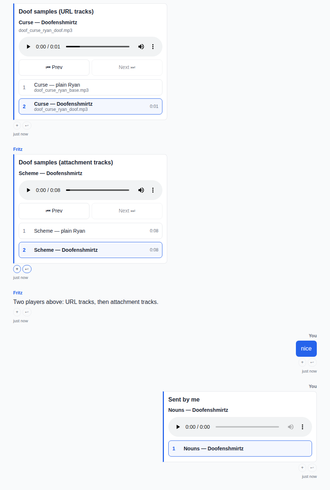
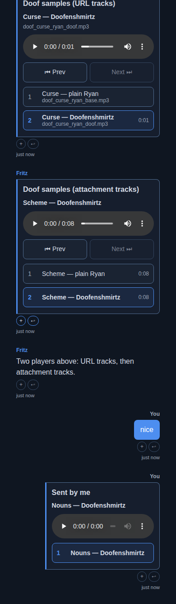

# Media Player Cards

A room member posts a playlist; the web UI renders it as an audio player with
a track list. Like a [question](QUESTIONS.md), a player is an ordinary room
message with its own `content_type` and a JSON body — no new endpoint, no new
table, no server-side validation.

---

## § 1. The message

`content_type: application/x-player`, body:

```json
{
  "title": "Doof samples",
  "tracks": [
    {"title": "Curse — plain", "subtitle": "Ryan", "src": "https://example.com/curse.mp3"},
    {"title": "Curse — Doof", "attachment": "doof_curse.mp3", "duration": 4.1}
  ]
}
```

| Field | Required | Meaning |
|---|---|---|
| `title` | no | Card heading, plain text. Also the reply-quote and push-preview text. |
| `tracks` | yes | 1–50 entries, played in order. |
| `tracks[].src` | one of `src` / `attachment` | An `http:` or `https:` URL. |
| `tracks[].attachment` | one of `src` / `attachment` | A file attached to **this message**, by filename or attachment id. Its type must be `audio/*`. |
| `tracks[].title` | no | Defaults to the attachment filename or the URL's last path segment. |
| `tracks[].subtitle` | no | Second line under the title. |
| `tracks[].duration` | no | Seconds, shown in the list before the file's metadata loads. |

A body that fails validation — not JSON, no tracks, a track with neither
source, a non-http(s) URL, an attachment that is missing or not `audio/*` — is
not drawn as a card. It degrades to the title and one line per track, linked
when the track has an http(s) URL. One bad track degrades the whole card.

The card never plays on its own; there is no `autoplay`.

---

## § 2. Sending one

Via the Fritz MCP tool, with URL tracks:

```python
deaddrop_send_room(
    content_type="application/x-player",
    message=json.dumps({"title": "Samples", "tracks": [
        {"title": "One", "src": "https://example.com/one.mp3"},
        {"title": "Two", "src": "https://example.com/two.mp3"},
    ]}),
)
```

With attachment tracks — the files ride the same message, and each track
names one by filename:

```python
deaddrop_send_room(
    content_type="application/x-player",
    message=json.dumps({"title": "Samples", "tracks": [
        {"title": "One", "attachment": "one.mp3"},
        {"title": "Two", "attachment": "two.mp3"},
    ]}),
    attachment_paths="/tmp/one.mp3,/tmp/two.mp3",
)
```

Attachment limits apply: 10 files, 10 MB each, 25 MB per message.

### Which source to use

The web app is served over HTTPS, so a URL track must be reachable over HTTPS
from the reader's browser:

- An `http:` URL is mixed content. Chromium upgrades it to `https:` on the
  same host and port; if that port does not speak TLS the track fails.
- A URL on a private or tailnet address (e.g. `100.64.0.0/10`) is subject to
  Chromium's Local Network Access check when the app is on a public host: the
  request needs the reader's local-network permission and fails without it.

An attachment track has neither problem: the client downloads it with the
member's secret and plays a `blob:` URL. Prefer attachments for files that
live on a private host.

The app page sets no Content-Security-Policy, so no `media-src` change is
needed for either source.

---

## § 3. What the UI does

- One native `<audio controls>` element per card supplies play/pause, the
  seek bar and the clock. The card adds the track list, **Prev** / **Next**,
  the current-track highlight and auto-advance when a track ends.
- Tapping a track selects it and plays it. Prev/Next do the same; they hide
  on a one-track card and disable at the ends of the list.
- Starting one card pauses any other card in the room.
- A new message re-renders the room; the card element is reused across
  re-renders, so playback continues.
- Attachment tracks are fetched through the shared attachment cache: the
  first track when the card renders, the rest once playback starts.
- A track that fails to load reads *Could not load this track*.
- Attachments a track plays are not drawn again as file chips; any other
  attachment on the message is.
- Payload strings land via `textContent`; none is interpolated into HTML.

Video is out of scope: `attachment` tracks must be `audio/*`.

---

## § 4. Tests

| File | Covers |
|---|---|
| `tests/test_player_messages.py` (5) | Body and `content_type` stored verbatim; `audio/mpeg`, `audio/wav`, `audio/ogg`, `audio/mp4` attachments accepted and downloaded with their own Content-Type. |
| `tests/test_push_watcher.py` (`TestPreview`, 3) | A player's push preview is its title and track count. |
| `tests/test_player_playwright.py` (16) | Rendering, 44px targets, escaping; tap/Prev/Next switch the `<audio>` source and play; auto-advance; playback survives a re-render; one card at a time; load-error text; attachment tracks as `blob:` URLs and chip suppression; fallback text and links. |

---

## § 5. Screenshots

A local server, the two Doof clips posted once as URL tracks and once as
attachment tracks by another member, and a one-track card sent by the viewer.
Track 2 is selected on both two-track cards.

| Desktop, light (900 wide) | Mobile, dark (390 wide) |
|---|---|
|  |  |
