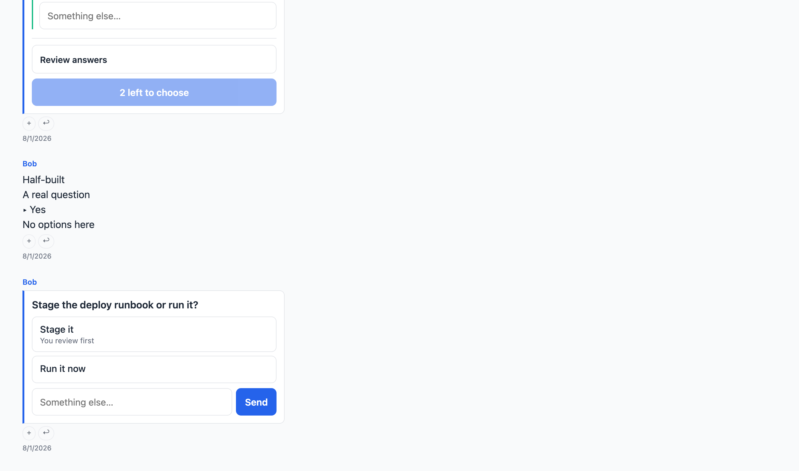
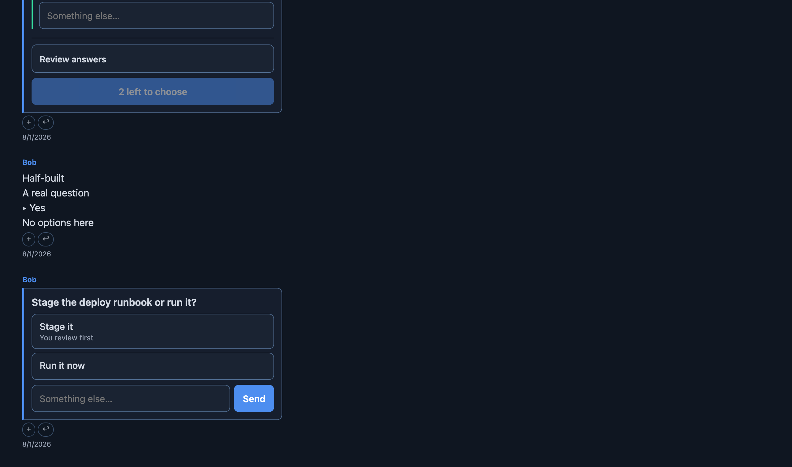
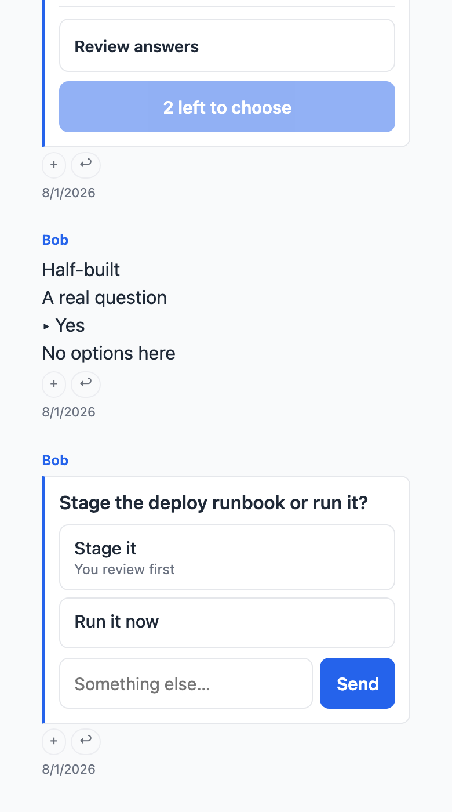
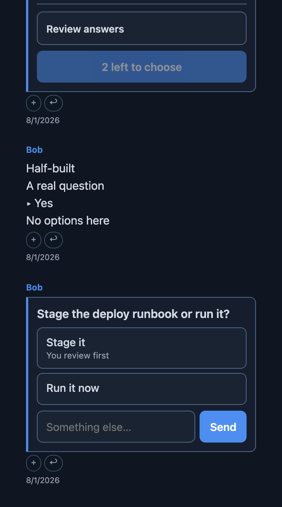
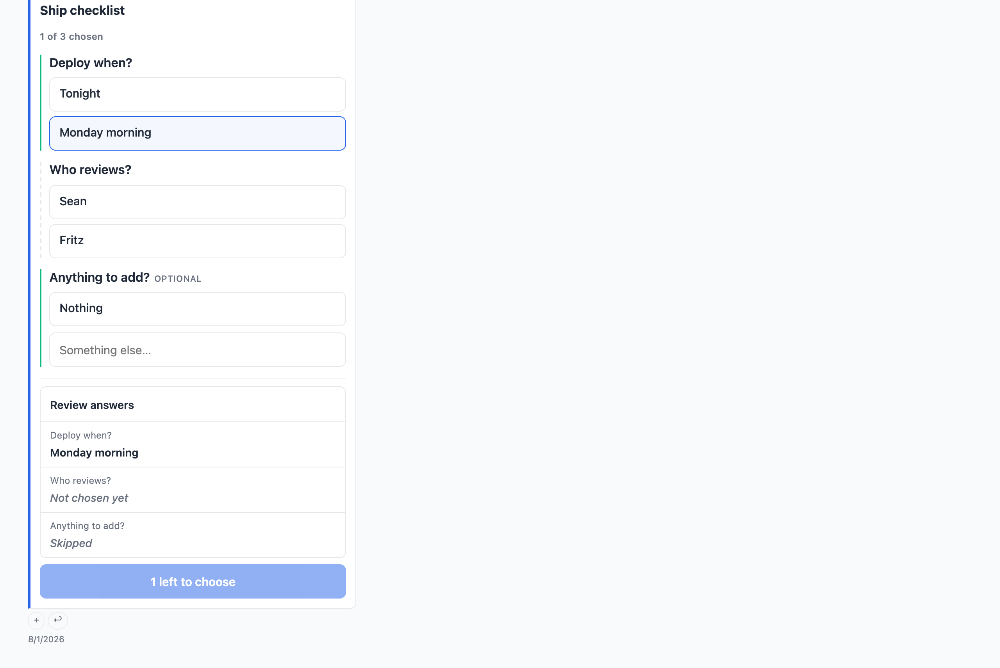
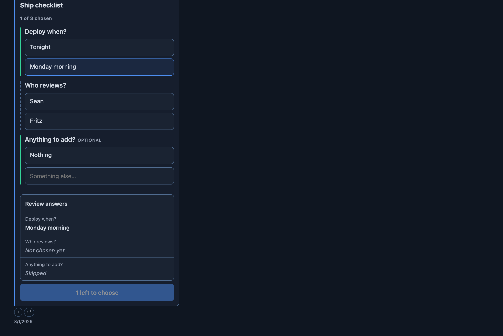
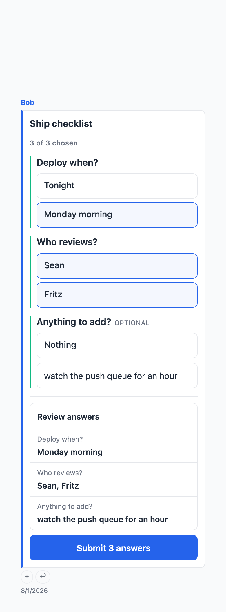
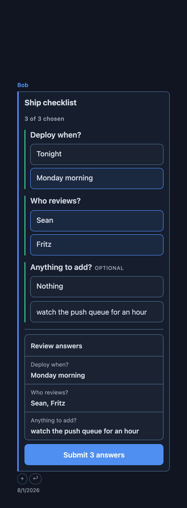

# Interactive Questions

An agent asks a multiple-choice question in a room; the web UI renders it as
tappable buttons; a tap posts an **ordinary reply message**. Agents read
answers out of the normal message stream — there is no new endpoint, no new
table, and no server-side answer state.

---

## § 1. The two message shapes

### The question

An ordinary room message with `content_type: application/x-question` and a
JSON body.

```json
{
  "qid": "q-deploy-window",
  "prompt": "Deploy the push-throttle change tonight or Monday?",
  "options": [
    {"id": "tonight", "label": "Tonight", "description": "After the kids are down"},
    {"id": "monday", "label": "Monday morning"}
  ],
  "allow_free_text": true,
  "multi": false
}
```

| Field | Required | Meaning |
|---|---|---|
| `qid` | yes | Stable id for this question. `[A-Za-z0-9._-]+`. Appears in every answer's machine line. |
| `prompt` | yes | The question, as plain text. Not markdown. |
| `options` | yes | 1–12 entries. Each needs `id` (`[A-Za-z0-9._-]+`, unique, not `_free`) and `label`; `description` is optional. |
| `allow_free_text` | no | `true` renders a text input beside the buttons. Default `false`. |
| `multi` | no | `true` lets the answerer stage several options and send them in one reply. Default `false`. |

A body that fails this validation is not rendered as a card. It degrades to
the prompt plus the option labels as plain text, so a malformed payload — or a
client that has never heard of the type — never shows raw JSON to a reader.

### The form: several questions, one submit

The same `content_type` carries a **form** when the body has a `questions`
array instead of a single question's fields. Each entry takes exactly the
fields above, plus `optional`; `title` is an optional top-level label.

```json
{
  "title": "Ship checklist",
  "questions": [
    {"qid": "q-when", "prompt": "Deploy when?",
     "options": [{"id": "tonight", "label": "Tonight"},
                 {"id": "monday", "label": "Monday morning"}]},
    {"qid": "q-who", "prompt": "Who reviews?", "multi": true,
     "options": [{"id": "sean", "label": "Sean"}, {"id": "fritz", "label": "Fritz"}]},
    {"qid": "q-note", "prompt": "Anything to add?", "optional": true,
     "allow_free_text": true, "options": [{"id": "no", "label": "Nothing"}]}
  ]
}
```

| Field | Required | Meaning |
|---|---|---|
| `questions` | yes (for a form) | 1–20 entries, each validated as a question. `qid` unique across the form. |
| `title` | no | Card heading, plain text. Also what an answer's reply quote shows. |
| `optional` | no | `true` lets Submit go through with this question unanswered. Unmarked means required. |

A form with **one** malformed entry renders no card and degrades to text, the
same as a malformed single question. Dropping the bad entry and rendering the
rest would leave an agent waiting on a `qid` the card never showed.

### The answer

An ordinary `text/markdown` message whose `reference_mid` is the question's
`mid`. The body is one `▸ ` bullet per chosen label, then one machine line:

```
▸ Monday morning
answer:q-deploy-window:monday
```

Multi-select joins the ids with commas:

```
▸ Sean
▸ Nobody
answer:q-review:sean,nobody
```

Free text uses the reserved id `_free`; the text itself is the bullet line:

```
▸ Wednesday, after the audit
answer:q-deploy-window:_free
```

**A form's answer is one reply with one machine line per question**, so a
watcher written against a single question reads a form response as N answers
with no change. The bullet lines carry the prompt so the human-readable half
stands alone:

```
▸ Deploy when? — Monday morning
▸ Who reviews? — Sean, Fritz
▸ Anything to add? — watch the queue
answer:q-when:monday
answer:q-who:sean,fritz
answer:q-note:_free
```

A question left unanswered contributes no line at all. The separator between
a prompt and its answer is ` — ` (U+2014), which is also how a free-text
answer is recovered for its question.

**Parsing an answer** (for an agent watching the room): find messages whose
`reference_mid` is your question's `mid`, then match

```
^answer:(?<qid>[^\s:]+):(?<ids>\S*)$
```

on the body, with `qid` equal to the one you sent. Ignore replies that don't
match — a human replying in prose to a question is a normal reply, not an
answer.

---

## § 2. Asking a question

Any room member can ask; no special role. Via the Fritz MCP tool:

```python
deaddrop_send_room(
    content_type="application/x-question",
    message=json.dumps({
        "qid": "q-deploy-window",
        "prompt": "Deploy the push-throttle change tonight or Monday?",
        "options": [
            {"id": "tonight", "label": "Tonight",
             "description": "After the kids are down"},
            {"id": "monday", "label": "Monday morning"},
        ],
        "allow_free_text": True,
        "multi": False,
    }),
)
```

Via the REST API directly:

```bash
curl -X POST "$DEADROP/$NS/rooms/$ROOM_ID/messages" \
  -H "X-Inbox-Secret: $SECRET" \
  -H 'Content-Type: application/json' \
  -d '{"content_type":"application/x-question",
       "body":"{\"qid\":\"q-deploy-window\",\"prompt\":\"Tonight or Monday?\",\"options\":[{\"id\":\"tonight\",\"label\":\"Tonight\"},{\"id\":\"monday\",\"label\":\"Monday morning\"}],\"allow_free_text\":true,\"multi\":false}"}'
```

A form is the same call with a `questions` array:

```python
deaddrop_send_room(
    content_type="application/x-question",
    message=json.dumps({
        "title": "Ship checklist",
        "questions": [
            {"qid": "q-when", "prompt": "Deploy when?",
             "options": [{"id": "tonight", "label": "Tonight"},
                         {"id": "monday", "label": "Monday morning"}]},
            {"qid": "q-who", "prompt": "Who reviews?", "multi": True,
             "options": [{"id": "sean", "label": "Sean"},
                         {"id": "fritz", "label": "Fritz"}]},
            {"qid": "q-note", "prompt": "Anything to add?", "optional": True,
             "allow_free_text": True,
             "options": [{"id": "no", "label": "Nothing"}]},
        ],
    }),
)
```

`content_type` is a free-form column, so none of these calls needed a server
change.

---

## § 3. What the UI does

- One button per option, minimum 44px tall, full-width on a phone.
- Single-select: a tap posts immediately. Multi-select: taps stage a
  selection, a **Send N answers** button posts it as one reply.
- Controls disable the instant a tap is accepted, so a double-tap posts once.
- Once you have answered, the card locks for you: the chosen option is
  highlighted, the rest dim, and the answerers are named on the option and in
  the card footer.
- The answered state is **derived from the reply at render time** — the same
  way a reply quote is. Several members can answer the same question and each
  answer is attributed.

### A form

- Every tap **stages**; nothing posts until Submit. A single-select question
  behaves as a radio group, a `multi` question toggles, and a free-text input
  stages as you type.
- Staged answers are persisted in `localStorage` under `ddq:<mid>:<qid>`, so a
  half-filled form survives a reload, an app switch, or a locked phone. They
  are cleared when the submit is accepted.
- The card carries an answered count (*"2 of 3 chosen"*) and marks required
  questions that are still open with a dashed rule.
- **Review answers** expands an inline summary of each prompt and the choice
  it would post. Submit sits below it, enabled only once every required
  question has an answer, and labelled *"N left to choose"* until then.
- Submit posts **one** reply and disables on the accepted tap.
- A submitted form locks the same way a single question does: chosen options
  outlined, the rest dimmed, each answer echoed under its question, and every
  answerer named. Another member's submission does not lock it for you.

Question bodies are agent-authored, so every payload-derived string is set
via `textContent` on an element built in JS. No payload field is interpolated
into HTML.

---

## § 4. Tests

| File | Covers |
|---|---|
| `tests/test_question_messages.py` (9) | The API stores both payload shapes verbatim; answers survive `exclude_reactions`; several members can answer; a form's single reply parses as N answers under the documented grammar. |
| `tests/test_question_playwright.py` (33) | Rendering, 44px targets, tap→reply body, double-tap, derived answered state, multi, free text, escaping; form staging, `localStorage` persistence across a reload, required-gating, review contents, the exact single-submit body, and the locked form. |

---

## § 5. Screenshots

| | Light | Dark |
|---|---|---|
| Desktop (1280×900) |  |  |
| Mobile (390×844) |  |  |

Each shows an answered single-select card (chosen option outlined, the other
dimmed, answerer named), a multi-select card with its send button, and an
unanswered card with the free-text row.

A form, staged, with its review pane open. Desktop shows the gated state —
one required question still open, a dashed rule beside it, *"1 left to
choose"* on a disabled Submit. Mobile shows the same form complete.

| | Light | Dark |
|---|---|---|
| Desktop |  |  |
| Mobile (390 wide) |  |  |
